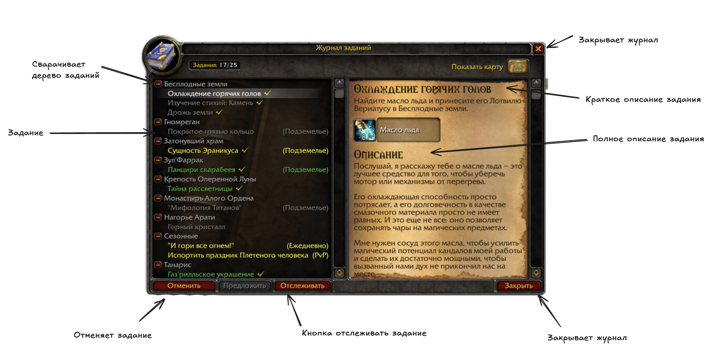

# Quest Book

**[English](#english) · [Русский](#русский)**



Quest Book is a standalone local quest journal inspired by the classic fantasy MMORPG interface. It is available in separate English and Russian editions for Windows x64.

> Current version: **a0.0.8 (alpha)**  
> Platform: **Windows 10/11 x64**

## English

**Quest Book** is a standalone journal for personal quests and goals, styled after the classic World of Warcraft 3.3.5 interface.

It is an independent application: it does not modify game files, connect to a game account or server, or track in-game quests automatically. You create and manage all quests, descriptions, and objectives yourself.

### Download and run

1. Open **Releases** on the repository page and select the latest version.
2. Under **Assets**, download `QuestBook-EN-a0.0.8-Windows-x64.zip`.
3. Extract the complete archive into a separate folder.
4. Run `QuestBookEN.exe`.

Do not move the EXE by itself: the `web` folder and all other files from the archive must remain next to it.

### Features

- create, edit, and delete quests;
- organize quests into collapsible trees;
- add objectives and mark them complete;
- keep short and full quest descriptions;
- set difficulty and color independently for every quest;
- configure rewards, quest tracking, and interface sounds;
- choose 100%, 130%, or 150% interface scale;
- minimize the application to the system tray;
- configure a global show/hide shortcut;
- save all changes automatically on your computer.

### Privacy

Quest Book works locally and does not require an account. Your quests and settings are stored only on your computer:

```text
%APPDATA%\Quest Book EN\quests.json
```

The application does not send your data to the developer and does not use cloud synchronization, telemetry, or analytics. Its core features work without an internet connection. The support link opens Boosty in your external browser only when you click it.

To back up your journal, copy the `quests.json` file. To remove all user data after deleting the application, delete `%APPDATA%\Quest Book EN`.

### System requirements

- 64-bit Windows 10 or Windows 11;
- Microsoft Edge WebView2 Runtime.

WebView2 is already installed on most modern computers. If the application reports that it is missing, install [Evergreen WebView2 Runtime from the official Microsoft page](https://developer.microsoft.com/microsoft-edge/webview2/).

### Windows SmartScreen notice

The current alpha build is not signed with a paid developer certificate. Windows SmartScreen may therefore display an unknown-publisher warning on first launch. If you downloaded the archive from this project's official page, choose **More info → Run anyway**.

Checksums for the official archives are published in `SHA256SUMS.txt` and in the release notes.

### English and Russian editions

Both editions can be used on the same computer. They store their data separately:

- EN: `%APPDATA%\Quest Book EN\quests.json`;
- RU: `%APPDATA%\Quest Book\quests.json`.

## Русский

**Quest Book** — отдельный журнал заданий для личных целей, оформленный в духе классического интерфейса World of Warcraft 3.3.5.

Это самостоятельная программа: она не изменяет файлы игры, не подключается к игровому аккаунту или серверу и не отслеживает игровые задания автоматически. Вы сами создаёте задания, описания и цели.

### Скачать и запустить

1. Откройте раздел **Releases** на странице репозитория и выберите последнюю версию.
2. В блоке **Assets** скачайте `QuestBook-a0.0.8-Windows-x64.zip`.
3. Полностью распакуйте архив в отдельную папку.
4. Запустите `QuestBook.exe`.

Не переносите EXE-файл отдельно: папка `web` и остальные файлы из архива должны находиться рядом с ним.

### Возможности

- создание, редактирование и удаление заданий;
- древовидная организация журнала;
- отдельные цели и отметки о выполнении;
- краткое и полное описание задания;
- настройка сложности и цвета каждого задания;
- награды, отслеживание заданий и игровые звуки интерфейса;
- масштабы интерфейса 100%, 130% и 150%;
- сворачивание в системный трей;
- настраиваемая глобальная горячая клавиша;
- автоматическое локальное сохранение.

### Конфиденциальность

Quest Book работает локально и не требует регистрации. Созданные задания и настройки хранятся только на вашем компьютере:

```text
%APPDATA%\Quest Book\quests.json
```

Программа не отправляет ваши данные разработчику и не использует облачную синхронизацию, телеметрию или аналитику. Основные функции доступны без подключения к интернету. Ссылка поддержки открывает Boosty во внешнем браузере только после нажатия пользователем.

Чтобы сделать резервную копию журнала, сохраните файл `quests.json`. Чтобы полностью удалить пользовательские данные после удаления программы, удалите папку `%APPDATA%\Quest Book`.

### Системные требования

- 64-битная Windows 10 или Windows 11;
- Microsoft Edge WebView2 Runtime.

WebView2 уже установлен на большинстве современных компьютеров. Если приложение сообщит, что компонент отсутствует, установите [Evergreen WebView2 Runtime с официальной страницы Microsoft](https://developer.microsoft.com/microsoft-edge/webview2/).

### Предупреждение Windows SmartScreen

Текущая альфа-сборка не подписана платным сертификатом разработчика. Поэтому при первом запуске Windows SmartScreen может показать предупреждение о неизвестном издателе. Если архив был скачан с официальной страницы этого проекта, нажмите **«Подробнее» → «Выполнить в любом случае»**.

Контрольные суммы официальных архивов опубликованы в файле `SHA256SUMS.txt` и в описании релиза.

### Английская и русская версии

Обе версии можно использовать одновременно. Их данные сохраняются раздельно:

- EN: `%APPDATA%\Quest Book EN\quests.json`;
- RU: `%APPDATA%\Quest Book\quests.json`.

## Project status and disclaimer

Quest Book a0.0.8 is an alpha release. Please report reproducible problems through GitHub Issues and include your Windows version and the edition you used.

This is an unofficial fan-made project and is not affiliated with, endorsed by, or sponsored by Blizzard Entertainment. Warcraft, World of Warcraft, and related names and assets belong to their respective rights holders.

This repository is used to distribute compiled builds and documentation. The source code is not published here.
